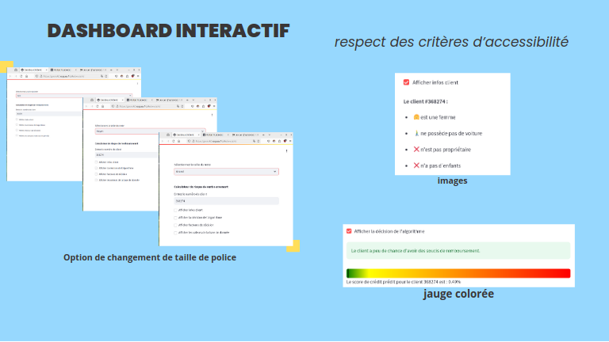

# Réalisation d'un Dashboard et Veille Technique

  

## Contexte

En tant que Data Scientist chez **Prêt à dépenser**, une société financière spécialisée dans les crédits à la consommation, j'ai été chargé de développer un dashboard interactif pour permettre aux chargés de relation client de mieux expliquer les décisions d'octroi de crédit. Ce dashboard s'appuie sur un modèle de scoring que j'ai précédemment développé, et vise à offrir une transparence maximale aux clients lors des rendez-vous.

Par ailleurs, j'ai également été chargé de réaliser une veille technique sur les dernières tendances en modélisation de données texte ou image, afin de comparer ces nouvelles techniques avec celles déjà mises en œuvre.

## Objectif du Projet

Le projet se compose de deux volets principaux :
1. **Conception d'un Dashboard de Credit Scoring** : Développer et déployer un dashboard interactif pour visualiser et expliquer les scores de crédit aux clients de manière transparente.
2. **Réalisation d'une Veille Technique** : Effectuer une veille sur une technique récente de modélisation en data science, réaliser une preuve de concept, et comparer cette nouvelle approche à une technique plus classique.

## Étapes de l'Analyse

1. **Développement du Dashboard** :
    - Conception d'un parcours utilisateur simple pour répondre aux besoins des chargés de relation client.
    - Création de graphiques interactifs permettant de visualiser les scores, les informations descriptives des clients, et les comparaisons avec d'autres clients.
    - Déploiement du dashboard sur une plateforme Cloud pour le rendre accessible aux utilisateurs finaux.
    - Prise en compte des critères d'accessibilité du WCAG pour garantir l'inclusivité du dashboard.

2. **Veille Technique et Preuve de Concept** :
    - Recherche et analyse d'une technique de modélisation récente (moins de 5 ans) dans le domaine du traitement de texte ou d'image.
    - Mise en œuvre d'une preuve de concept pour tester cette nouvelle technique sur un jeu de données utilisé précédemment.
    - Comparaison des résultats de la nouvelle technique avec ceux obtenus à l'aide d'une approche classique.

## Livrables

- **Application de Dashboard** : Un dashboard interactif déployé sur le Cloud, répondant aux spécifications fournies, et accessible aux chargés de relation client.
- **Notebook de Veille Technique** : Mise en œuvre d'une technique récente de modélisation de données texte ou image, comparée à une approche classique.
- **Note Méthodologique** : Un document PDF présentant la preuve de concept, le choix des algorithmes, les métriques utilisées, et les conclusions sur la nouvelle technique (10 pages maximum).
- **Support de Présentation** : Présentation de 30 slides maximum détaillant le travail réalisé sur le dashboard et la veille technique.

## Soutenance

La soutenance se déroulera en deux parties principales :
- **Présentation du Dashboard (10 minutes)** : 
  - Présentation des graphiques interactifs du dashboard.
  - Démonstration en direct de l'application déployée sur le Cloud.
- **Présentation de la Veille Technique (7 minutes)** :
  - Description de la nouvelle approche ou technique étudiée.
  - Synthèse comparative des résultats avec l'approche classique.

### Visionner la Soutenance

Vous pouvez visionner l'enregistrement de la soutenance à l'adresse suivante : [Lien vers la vidéo](https://youtu.be/PeBc0opDB08?si=KeX1_bmV9_5QF3BN).

## Contact

Pour plus d'informations sur moi ou pour accéder à mes coordonnées, veuillez visiter mon site web : [alexandre.rogues.fr](https://alexandre.rogues.fr).

Merci de l'intérêt que vous portez à ce projet !

